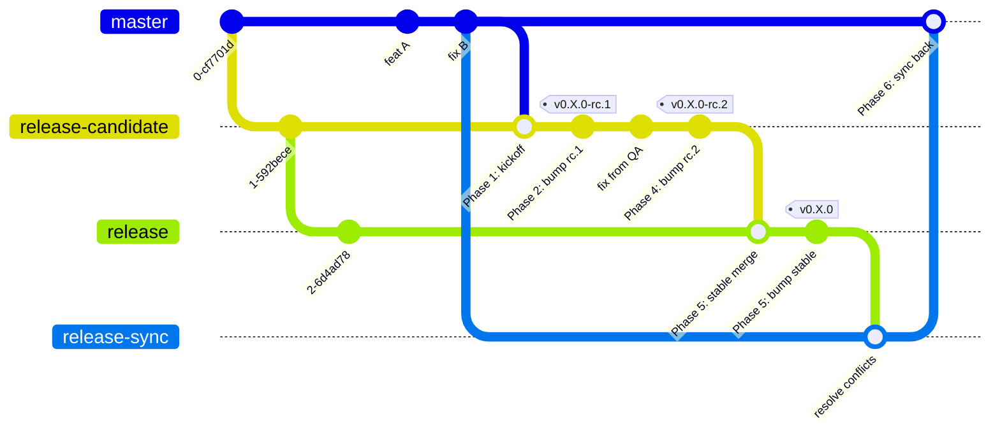

# Hathor Wallet Mobile — Release Process

> **Audience.** This document is written primarily for Claude Code agents (or any AI coding assistant) executing a release on this repository, and for the engineers reviewing or initiating that work. It is structured as a sequence of phases — jump to the phase that matches the task at hand.
>
> **Scope.** Git, PRs, version bumps, signed tags, GitHub releases, release-notes formatting, and the merge dance across `master` ↔ `release-candidate` ↔ `release`. Out of scope: QA, device builds, App Store / Play Store rollout. Those are owned by the canonical guide at `HathorNetwork/ops-tools` `docs/release-guides/hathor-wallet-mobile.md` (private repo) and the in-repo `QA.md`.
>
> **How to invoke this with Claude Code.** Type `/release` (or `/release <phase>`, e.g. `/release bump`). The slash command at `.claude/commands/release.md` wraps this document.

## Operating rules for agents

Read these before doing anything else. They override anything that looks "obvious" further down.

1. **Identify the phase first.** Phases 1–6 below are sequential within a release cycle; you execute one at a time. If the user has not said which phase they want, ask before touching anything.
2. **Confirm before any irreversible or outward-facing action.** Pushing a tag, creating a GitHub release, opening a PR, merging a PR, posting to Slack — show the exact command and content and pause for the user to confirm. These actions create artefacts (tags, releases, "mentioned in" backlinks, notifications) that are difficult or impossible to fully retract.
3. **Signed tags only.** Always `git tag -s`, always verify with `git tag -v` before pushing. If GPG signing fails, stop and surface the error. Never fall back to an unsigned tag "just to keep moving."
4. **Every release the agent creates is a GitHub pre-release.** Always pass `--prerelease` to `gh release create` — for rc tags (`vX.Y.Z-rc.N`) and for the stable tag (`vX.Y.Z`) alike. The agent never marks anything "Latest". Promotion of a stable release from **Pre-release** to **Latest** is a manual step performed by the product manager in the GitHub UI, after their own review — they flip the very release instance the agent created. Do not pass anything that would set Latest, and do not flip it yourself.
5. **Build PR-lists locally before pasting them into PR bodies or release notes.** GitHub creates **permanent** "mentioned in" backlinks on every PR you reference. Editing the body afterwards does not remove them. Draft the list to a scratch file (e.g., `drafts/` or `/tmp/`), confirm it with the user, then paste once.
6. **Never hand-edit version files.** `make bump` is the source of truth. The script encodes subtle rules (iOS `MARKETING_VERSION` drops the `-rc` suffix; `CURRENT_PROJECT_VERSION` follows a separate numbering; Android `versionCode` is monotonic) that will drift from any written checklist over time. PR templates that list individual files are informational, not authoritative.
7. **Stay in scope.**
   - Don't run QA, build, or store-publishing steps from this document. Hand off to the canonical ops-tools guide when those are needed.
   - Don't retroactively "fix" previous releases. Unsigned past tags, mis-flagged historical releases (e.g., a stable that wasn't marked Latest), or older notes in a different format from this document are not the agent's responsibility. Mention the observation in the run summary if it seems useful; do not modify or re-publish prior releases.

## Branch model

- **`master`** — main development branch. Every feature PR is **squash-merged** into `master`. This keeps `master` linear and makes the release changelog recipe (one squash-commit per PR) work.
- **`release-candidate`** — staging branch for the next release. Receives merges from `master` and version bumps with an `-rc.N` suffix. Tags on this branch are GitHub **pre-releases**.
- **`release`** — public stable branch. The agent publishes tags on this branch as GitHub **pre-releases**; the product manager later promotes the chosen one to **Latest** manually. After every release, changes are synced back to `master` through a dedicated PR.



## Prerequisites

- **Squash-merge on `master`.** Every PR into `master` uses GitHub's "Squash and merge". Required for the changelog recipe.
- **Approvals.** `.github/CODEOWNERS` requires `@pedroferreira1` on every PR. Independent of CODEOWNERS, **all release-related PRs require 2 reviewer approvals** before merge.
- **One cycle at a time.** Once Phase 1 has merged, no new release-candidate is kicked off until the current cycle is fully released and synced back (Phase 6 complete).

## Phase 1 — Start the release (master → release-candidate)

**Goal.** Open and merge the PR that brings every `master` commit since the last release into `release-candidate`. **No version bump in this PR.**

### Steps

1. Sync local branches:

   ```sh
   git fetch origin
   git checkout release-candidate
   git pull --ff-only
   ```

2. Open the PR using the `release_candidate_pr_template.md`:

   ```sh
   gh pr create \
     --repo HathorNetwork/hathor-wallet-mobile \
     --base release-candidate \
     --head master \
     --title "[v<X.Y.Z>-rc.1] Start release process" \
     --body-file .github/PULL_REQUEST_TEMPLATE/release_candidate_pr_template.md
   ```

   - **Title format:** `[v<X.Y.Z>-rc.1] Start release process`, where `<X.Y.Z>` is the upcoming version (a `minor` bump from the last stable, in the common case). The bracketed `[v...]` prefix mirrors the Phase 5.1 title and keeps the PR list readable.
   - The template body reminds reviewers that the version bump is a separate PR. Leave it as-is.

3. After review, **merge with a merge commit** — not squash, not rebase. The point is to preserve the shared ancestry of `master` and `release-candidate` so Phase 5 and Phase 6 work. In the GitHub UI choose "Create a merge commit". Via CLI:

   ```sh
   gh pr merge <PR-number> --repo HathorNetwork/hathor-wallet-mobile --merge
   ```

### Common mistakes

- Squashing or rebasing the kickoff merge — destroys the shared ancestor commit.
- Including version-file changes in this PR — bumps belong in Phase 2.
- Starting a new cycle before the previous one is fully released and synced back — multiple parallel cycles are not supported.

## Phase 2 — RC bump PR

**Goal.** Bump the version on `release-candidate` to `<X.Y.Z>-rc.N` and produce a PR whose body lists every content PR included since the last release.

### Pick the right `updateType`

| Situation | Command | Example |
|---|---|---|
| First rc of a new minor release (most common) | `make bump updateType=minor bumpRc=true` | `0.38.0` → `0.39.0-rc.1` |
| First rc of a new major release | `make bump updateType=major bumpRc=true` | `0.38.0` → `1.0.0-rc.1` |
| First rc of a hotfix | `make bump updateType=patch bumpRc=true` | `0.38.0` → `0.38.1-rc.1` |
| Subsequent rc within the same cycle (`rc.N` → `rc.N+1`) | `make bump updateType=rc` | `0.39.0-rc.1` → `0.39.0-rc.2` |
| Stable release — Phase 5 only, on `release` | `make bump updateType=release` | `0.39.0-rc.3` → `0.39.0` |

`make bump` enforces a branch guard: it refuses to run on any branch other than `release` or `release-candidate`, refuses to produce an `-rc` version on `release`, and refuses to produce a non-`-rc` version on `release-candidate`. Run `node scripts/bump-version.js` (with no arguments) for the inline help with all combinations.

### Workflow

The bump must be calculated on `release-candidate` (the script reads that branch's `package.json` and checks the branch guard) and then moved onto a feature branch for the PR:

```sh
git checkout release-candidate
git pull --ff-only

make bump updateType=<type> bumpRc=true   # or: make bump updateType=rc

# make bump has now edited four files in the working tree:
#   - package.json
#   - package-lock.json
#   - android/app/build.gradle  (versionCode++, versionName)
#   - ios/HathorMobile.xcodeproj/project.pbxproj  (MARKETING_VERSION, CURRENT_PROJECT_VERSION)

git checkout -b chore/bump-v<version>
git add -A
git commit -m "chore: bump version to <version>"
git push -u origin chore/bump-v<version>
```

**Conventions:**

- Branch name: `chore/bump-v<version>` (e.g., `chore/bump-v0.39.0-rc.2`).
- Commit message: `chore: bump version to <version>` — no `v` prefix, all lowercase.
- PR title: `chore: bump to v<version>` — `v` prefix here.
- PR base: `release-candidate`. PR head: the bump branch.
- PR template: `version_bump_pr_template.md`.

The file-list checklist in `version_bump_pr_template.md` is **informational only** — `make bump` already did all of it. Pre-check the boxes when filling the body to acknowledge the artefacts produced.

### Building the "Includes the following PRs" list

The PR body lists every content PR included in this rc — by **number only** (`#876`, not `#876 - title`). GitHub auto-renders each `#N` as a clickable link with title and status, so adding the title manually is noise.

What to exclude from the list:

- The bump PR itself (`chore: bump to v...` / `chore: bump version to ...`) — it is the release artefact, not content.
- Any `[vX.Y.Z] Sync master with release` PR — its content was in the previous release (it's Phase 6 of the previous cycle).

Recipe — works for any `rc.N`:

```sh
# PREV_TAG is the most recent published tag whose content is already shipped.
#   - For rc.1: the previous stable tag (e.g., v0.38.0).
#   - For rc.N (N >= 2): the previous rc tag of this cycle (e.g., v0.39.0-rc.1).

PREV_TAG=v<previous>

# List subjects of every commit reachable from release-candidate but not from PREV_TAG.
git log "${PREV_TAG}..release-candidate" --pretty=format:'%s'
```

In each squash-merge subject, GitHub appends the source PR number as `(#N)`. Extract:

```sh
git log "${PREV_TAG}..release-candidate" --pretty=format:'%s' \
  | grep -oE '#[0-9]+' \
  | awk '!seen[$0]++'    # dedup, preserve order
```

Then **read the list** and remove any bump PRs and any `[vX.Y.Z] Sync master with release` PRs (use `gh pr view <num> --json title` to disambiguate if needed). Save the cleaned list to a scratch file. Only paste it into the PR body once the user has confirmed it — backlinks are permanent.

### PR body template

```markdown
### Acceptance Criteria
- Bump to v<version>
- Includes the following PRs:
  - #<num>
  - #<num>
  - …

### Checklist
- [x] Make sure you updated the `CURRENT_PROJECT_VERSION` with the appropriate release-candidate version in `ios/HathorMobile.xcodeproj/project.pbxproj`
- [x] Make sure you updated the `MARKETING_VERSION` with the appropriate version in `ios/HathorMobile.xcodeproj/project.pbxproj`
- [x] Make sure you updated the version attribute in `package.json`
- [x] Make sure you updated the version attribute in `package-lock.json`
- [x] Make sure you incremented the `versionCode` attribute in `android/app/build.gradle`
- [x] Make sure you updated the `versionName` with the appropriate version, including the release candidate number in `android/app/build.gradle`
```

The checklist items are pre-checked because `make bump` already did them — they describe the artefacts produced, not steps to repeat.

### Open the PR

```sh
gh pr create \
  --repo HathorNetwork/hathor-wallet-mobile \
  --base release-candidate \
  --head chore/bump-v<version> \
  --title "chore: bump to v<version>" \
  --body-file drafts/bump-pr-body.md
```

## Phase 3 — Approvals, signed tag, GitHub pre-release

**Goal.** After the bump PR merges, tag `release-candidate` and publish the GitHub pre-release with grouped notes.

### 3.1 — Approvals and merge

- **2 reviewer approvals** required.
- **Squash and merge** the bump PR (it's a single commit; squash keeps `release-candidate` history clean).

### 3.2 — Signed tag

```sh
git fetch origin release-candidate
git checkout release-candidate
git pull --ff-only

# Sanity: HEAD should be the merged bump commit.
git log -1 --pretty=oneline

git tag -s v<version> -m "v<version>"
git tag -v v<version>          # MUST report: "Good signature from <your key UID>"
git push origin v<version>
```

- Tag format: `v<version>` with the `v` prefix (e.g., `v0.39.0-rc.2`).
- Always use `-s`. If GPG signing fails, **stop and fix the GPG setup** — do not fall back to an unsigned tag.
- Tag the `release-candidate` HEAD *after* the bump PR merge — never the bump-branch tip.

### 3.3 — GitHub pre-release

rc tags must **never** be marked GitHub "Latest". Pass `--prerelease` explicitly:

```sh
gh release create v<version> \
  --repo HathorNetwork/hathor-wallet-mobile \
  --title v<version> \
  --prerelease \
  --notes "$(cat <<'EOF'
<paste-release-notes-body-here>
EOF
)"
```

Verify:

```sh
gh release list --repo HathorNetwork/hathor-wallet-mobile --limit 3
```

The new release should appear as `Pre-release`. The previous stable shows `Latest` only if the product manager already promoted it; otherwise it too is a `Pre-release`. Either way, the agent never changes that flag.

### 3.4 — Release-notes format

Group entries by conventional-commit prefix. Match the prefix at the start of the PR title, case-insensitive, up to the first `:` or `(` (so `fix:`, `fix(scope):`, and `Fix:` all map to the same group). Preserve the original prefix verbatim in the rendered line.

| PR title prefix | Group |
|---|---|
| `feat` | Features |
| `fix` | Fixes |
| `refactor` | Refactors |
| `docs` | Documentations |
| `chore` | Others |
| anything else | Unclassified |
| no prefix | Others |

**Group order** (omit empty groups, use `###` headings):

1. Features
2. Fixes
3. Refactors
4. Documentations
5. Others
6. Unclassified

**Per-entry format** (preserve input order within each group; do not include author):

```
- <original-prefix> <title> — <PR-URL>
```

**Footer** — full changelog comparing against the previous **final** release tag (not the previous rc):

```
**Full Changelog**: https://github.com/HathorNetwork/hathor-wallet-mobile/compare/v<previous-final>...v<this-version>
```

Collect titles via:

```sh
for N in $(cat drafts/pr-list.txt); do
  gh pr view "${N#\#}" --repo HathorNetwork/hathor-wallet-mobile --json number,title,url
done
```

Do **not** use `gh release create --generate-notes`. It produces a flat list with author attribution; that's not this format.

#### Example (the v0.39.0-rc.2 release)

```markdown
### Fixes
- fix: rc errors on importing and sending fbt — https://github.com/HathorNetwork/hathor-wallet-mobile/pull/876

**Full Changelog**: https://github.com/HathorNetwork/hathor-wallet-mobile/compare/v0.38.0...v0.39.0-rc.2
```

### 3.5 — Notify

Inform whoever builds and publishes for App Store / Play Store internal testers. Suggested Slack message:

```
v<version> is tagged and ready for build. Tag: https://github.com/HathorNetwork/hathor-wallet-mobile/releases/tag/v<version>
```

The exact recipient and channel are not codified in this repo — confirm in the team Slack. The canonical ops-tools guide also requests opening a build-request issue on `HathorNetwork/internal-issues`.

## Phase 4 — RC iterations (rc.N → rc.N+1)

If QA finds a bug on `v<X.Y.Z>-rc.N`:

1. **Fix the bug.** Branch off `release-candidate`, open a PR with base `release-candidate`. Squash-merge after review.
   - If the bug is critical, open a parallel PR targeting `master` with the same fix so it doesn't regress next cycle.
2. **Bump.** Repeat Phase 2 with `make bump updateType=rc` (`rc.1` → `rc.2`). The "Includes the following PRs" list contains only the new fixes merged since the previous rc tag (use `PREV_TAG=v<X.Y.Z>-rc.<N-1>` in the recipe).
3. **Tag and release.** Repeat Phase 3 with the new version. The new tag is also a GitHub **pre-release**.

The previous rc tag and release are left intact — never delete or re-tag an rc that was already published.

## Phase 5 — Stable release (release-candidate → release)

**Goal.** Promote the last rc to the public stable release.

### 5.1 — Promotion PR (release-candidate → release)

```sh
git fetch origin
git checkout release-candidate
git pull --ff-only

gh pr create \
  --repo HathorNetwork/hathor-wallet-mobile \
  --base release \
  --head release-candidate \
  --title "[v<X.Y.Z>] Start public release" \
  --body "Stable release of v<X.Y.Z>, promoting v<X.Y.Z>-rc.<N> after successful QA."
```

- **Title format:** `[v<X.Y.Z>] Start public release` (no `-rc` suffix).
- **Body:** short — name the rc being promoted. The PR list is already documented in the latest rc's release notes; a link suffices.
- **Merge with a merge commit** — not squash, not rebase. `release` and `release-candidate` must stay structurally in sync.
- **2 approvals** required.

### 5.2 — Stable bump PR

After the promotion merge, drop the `-rc` suffix on `release`:

```sh
git checkout release
git pull --ff-only

make bump updateType=release

git checkout -b chore/bump-v<X.Y.Z>
git add -A
git commit -m "chore: bump version to <X.Y.Z>"
git push -u origin chore/bump-v<X.Y.Z>
```

- PR base: `release`. PR head: the bump branch.
- PR title: `chore: bump to v<X.Y.Z>`.
- PR template: `version_bump_pr_template.md`.
- PR body shape matches Phase 2. For the "Includes the following PRs" list, the simplest approach is to link the most recent rc release on GitHub (which already aggregates everything in the cycle) rather than re-list every PR. If the team prefers an explicit list, build it from `PREV_TAG=v<previous-stable>` in the Phase 2 recipe.
- **2 approvals; squash-merge.**

### 5.3 — Signed stable tag

```sh
git fetch origin release
git checkout release
git pull --ff-only

git log -1 --pretty=oneline       # should be the merged stable-bump commit
git tag -s v<X.Y.Z> -m "v<X.Y.Z>"
git tag -v v<X.Y.Z>
git push origin v<X.Y.Z>
```

### 5.4 — GitHub release (pre-release)

The agent publishes the stable tag as a **pre-release** — pass `--prerelease`, exactly as for an rc. The product manager later flips this same release instance from **Pre-release** to **Latest** in the GitHub UI, after their review. The agent never marks it Latest itself (see operating rule #4):

```sh
gh release create v<X.Y.Z> \
  --repo HathorNetwork/hathor-wallet-mobile \
  --title v<X.Y.Z> \
  --prerelease \
  --notes "$(cat <<'EOF'
<paste-aggregated-release-notes-here>
EOF
)"
```

Use the same grouped format from Phase 3.4, aggregated across **all** rcs of this cycle (i.e., every content PR from the previous stable to this one). The Full Changelog footer compares against the previous stable tag:

```
**Full Changelog**: https://github.com/HathorNetwork/hathor-wallet-mobile/compare/v<previous-stable>...v<X.Y.Z>
```

Verify:

```sh
gh release list --repo HathorNetwork/hathor-wallet-mobile --limit 5
```

The new `v<X.Y.Z>` should show **Pre-release**, like every release the agent creates. It stays that way until the product manager manually promotes it to **Latest** in the GitHub UI — that promotion is outside this document's scope.

### 5.5 — Build and rollout

Out of scope here. Hand off to the canonical ops-tools guide for App Store and Play Store builds, and to the phased-rollout schedule.

## Phase 6 — Sync back (release → master)

**Goal.** Create a common ancestor commit between `release` and `master` so future cycles diverge cleanly. **This phase exists for that single reason — a squash merge defeats it entirely.**

### Steps

```sh
git fetch origin
git checkout release
git pull --ff-only

# Intermediary branch off the freshly tagged release.
git checkout -b release-sync

# Merge master into release-sync. Resolve any conflicts carefully.
git merge origin/master
# On conflicts: edit, `git add`, `git commit`. Do NOT use --squash.
# Coordinate with the original PR authors if you're unsure how to resolve.

git push -u origin release-sync

gh pr create \
  --repo HathorNetwork/hathor-wallet-mobile \
  --base master \
  --head release-sync \
  --title "[v<X.Y.Z>] Sync master with release" \
  --body "Sync \`release\` back into \`master\` after the v<X.Y.Z> stable release. **Must be merged with a merge commit, not squash.**"
```

- **Title format:** `[v<X.Y.Z>] Sync master with release`. The bracketed prefix is recognised by the Phase 2 changelog recipe and excluded from future bump PR lists.
- **Merge with a merge commit** in the GitHub UI ("Create a merge commit"). Squash or rebase here defeats the entire purpose: no shared ancestor would be created, and the next release cycle would face the same divergence again.
- Conflict resolution requires care. If you are not the author of the conflicting code, contact the author before forcing a resolution. Getting this wrong silently loses work.
- **2 approvals** required.

After this PR merges, the cycle is complete. `master` and `release` share an ancestor again, and the next Phase 1 can be opened.

## Hotfix flow (on `release`)

If a critical bug is found **after** the stable release tag is published:

1. **Fix.** Branch off `release`, PR base `release`. Squash-merge after review.
2. **Bump.** On `release`:

   ```sh
   git checkout release
   git pull --ff-only
   make bump updateType=patch
   git checkout -b chore/bump-v<X.Y.(Z+1)>
   git add -A
   git commit -m "chore: bump version to <X.Y.(Z+1)>"
   git push -u origin chore/bump-v<X.Y.(Z+1)>
   ```

   PR title: `chore: bump to v<X.Y.(Z+1)>`. PR base: `release`. Same `version_bump_pr_template.md`. 2 approvals; squash-merge.

3. **Tag and release.** Repeat Phase 5.3 and 5.4 with the new patch version. Like every release the agent creates, the hotfix release is published as a **pre-release**; the product manager promotes it to **Latest** manually.

4. **Parallel fix on `master`.** Open a PR with the same fix targeted at `master` so the bug doesn't regress next cycle.

5. **Sync back.** Run Phase 6 again after the hotfix release.

## Quick reference

### `make bump` cheat-sheet

| Branch | Command | Effect |
|---|---|---|
| `release-candidate` | `make bump updateType=minor bumpRc=true` | `X.Y.Z` → `X.(Y+1).0-rc.1` |
| `release-candidate` | `make bump updateType=major bumpRc=true` | `X.Y.Z` → `(X+1).0.0-rc.1` |
| `release-candidate` | `make bump updateType=patch bumpRc=true` | `X.Y.Z` → `X.Y.(Z+1)-rc.1` |
| `release-candidate` | `make bump updateType=rc` | `X.Y.Z-rc.N` → `X.Y.Z-rc.(N+1)` |
| `release` | `make bump updateType=release` | `X.Y.Z-rc.N` → `X.Y.Z` |
| `release` | `make bump updateType=patch` | `X.Y.Z` → `X.Y.(Z+1)` (hotfix) |

The script edits four files: `package.json`, `package-lock.json`, `android/app/build.gradle`, and `ios/HathorMobile.xcodeproj/project.pbxproj`. The branch guard refuses to run on anything except `release` or `release-candidate`.

### Merge-strategy matrix

| PR | Strategy | Why |
|---|---|---|
| Feature branch → `master` | **Squash** | Linear `master`, one commit per PR (drives the changelog recipe). |
| `master` → `release-candidate` (Phase 1) | **Merge commit** | Preserves shared ancestry with `master`. |
| Bump PR → `release-candidate` (Phase 2) | **Squash** | Single-commit PR; reads cleanly. |
| Feature branch → `release-candidate` (Phase 4 fix) | **Squash** | Same reason as `master` PRs. |
| `release-candidate` → `release` (Phase 5.1) | **Merge commit** | Preserves shared ancestry. |
| Bump PR → `release` (Phase 5.2 stable, or hotfix) | **Squash** | Single-commit PR. |
| `release-sync` → `master` (Phase 6) | **Merge commit** | This is the entire reason Phase 6 exists. |

### PR titles at a glance

| Phase | Title format |
|---|---|
| 1 | `[v<X.Y.Z>-rc.1] Start release process` |
| 2 | `chore: bump to v<X.Y.Z>-rc.N` |
| 4 (fix) | Normal feature/fix PR title (e.g., `fix(...)`) |
| 5.1 | `[v<X.Y.Z>] Start public release` |
| 5.2 | `chore: bump to v<X.Y.Z>` |
| 6 | `[v<X.Y.Z>] Sync master with release` |
| Hotfix bump | `chore: bump to v<X.Y.(Z+1)>` |

### What the changelog recipe ignores

These PR titles should not appear in any "Includes the following PRs" list inside a bump PR body:

- The bump PR itself (`chore: bump to v...` / `chore: bump version to ...`).
- Sync PRs (`[vX.Y.Z] Sync master with release`) — their content was in the previous release.

### Legacy: `changelogs/unreleased/`

The repository contains a `changelogs/unreleased/` directory with YAML fragments dated late 2024. No tooling in this repo currently consumes those files, and recent releases (v0.38.0, v0.39.0-rc.1, v0.39.0-rc.2) built their notes from PR titles using the recipe in Phase 3.4. **Treat the directory as legacy** — do not write to it as part of this process. If the team decides to revive a fragment-based changelog, this document needs an explicit update.

## See also

- `.github/PULL_REQUEST_TEMPLATE/release_candidate_pr_template.md` — Phase 1 PR template.
- `.github/PULL_REQUEST_TEMPLATE/version_bump_pr_template.md` — Phase 2 and 5.2 PR template.
- `.github/CODEOWNERS` — required reviewers.
- `scripts/bump-version.js` — `make bump` source of truth.
- `QA.md` — QA process run on each rc.
- `HathorNetwork/ops-tools` `docs/release-guides/hathor-wallet-mobile.md` — canonical full life-cycle (private repo) including QA, device builds, and store rollout.
- `HathorNetwork/ops-tools` `docs/release-guides/common-tasks.md` — origin of the `release-sync` pattern used in Phase 6.
